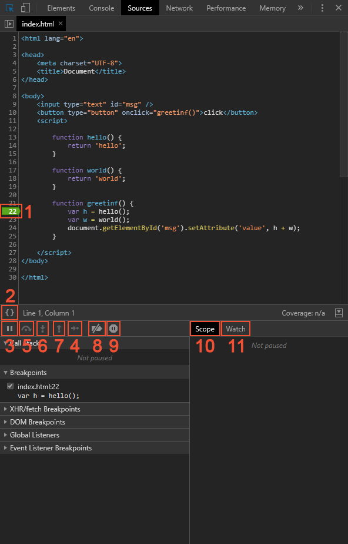

크롬 개발자 도구의 `Sources`패널로 디버깅을 할 수 있다.

## 예제

```javascript
function hello() {
    return 'hello';
}

function world() {
    return 'world';
}

function greetinf() {
    var h = hello();
    var w = world();
    document.getElementById('msg').setAttribute('value', h + w);
}
```

```html
<input type="text" id="msg" />
<button type="button" onclick="greetinf()">click</button>
```

버튼을 클릭하면 `greetinf`함수가 실행되며, `h`, `w`변수에 차례대로 값이 할당된 후 인풋 태그에 결과 값(helloworld)이 출력되는 구문이다.

## 결과
<script>
function hello() {
    return 'hello';
}

function world() {
    return 'world';
}

function greetinf() {
    var h = hello();
    var w = world();
    document.getElementById('msg').setAttribute('value', h + w);
}
</script>
<div>
    <input type="text" id="msg" />
    <button type="button" onclick="greetinf()">click</button>
</div>

## 디버깅
크롬 개발자 도구의 소스탭을 들어가면 아래 처럼 확인할 수 있다.



개발자 도구는 특정 라인이 아닌 글로벌한 이벤트에 대해 중단점을 만들 수 있다. 좌측 하단의 `Event Listener Breakpoints`탭으로 들어가  `Mouse > click`를 체크해준다. 화면으로 넘어가 버튼을 클릭하면 이벤트가 실행되면서 이벤트가 실행된 코드를 소스탭에서 확인할 수 있다.

### 1. Breakpoints
중단점을 이용하면 실행이 중지된 시점에 변수가 어떤 값을 담고 있는지 알 수 있다. 또한 실행이 중지된 시점을 기준으로 명령어를 실행할 수도 있다.

### 2. Pretty Print
압축 파일(min)을 보기 좋게 정렬하여 볼 수 있다.

### 3. Resume Script Execution(단축키: F8)
스크립트 실행을 다시 시작한다. 추가 중단점이 없는 경우, 실행이 쭉 이어지고 디버거는 동작하지 않는다.

### 4. Step (단축키 F9)
다음 명령어를 실행한다. `Step`버튼을 계속 누르면 스크립트 전체를 문 단위로 하나하나 실행할 수 있다.

### 5. Step over next function call(단축키 F10)
다음 명령어를 실행하되, 함수 안으로 들어가진 않는다. `Step`과 유사하지만, 다음 문이 함수 호출일 때 `Step`과는 다르게 동작한다.(`alert` 같은 내장함수에는 해당하지 않고, 직접 작성한 함수일 때만 동작이 다르다.) `Step`은 함수 내부로 들어가 함수 본문 첫 번째 줄에서 실행을 멈춘다. 반면 `Step over next function call`은 보이지 않는 곳에서 중첩 함수를 실행하긴 하지만 함수 내로 진입하지 않는다. 함수 호출 시 내부에서 어떤 일이 일어나는지 궁금하지 않을 때 유용하다. 실행은 함수 실행이 끝난 후에 즉시 멈춘다.

### 6. Step into next function call(단축키 F11)
`Step`과 유사한데, 비동기 함수 호출에서 `Step`과는 다르게 동작한다. `Step`은 `setTimeout`(함수 호출 스케줄링에 쓰이는 내장 메서드)같은 비동기 동작은 무시한다. 반면 `Step into next function call`는 비동기 동작을 담당하는 코드로 진입하고, 필요하다면 비동기 동작이 완료될 때까지 대기한다.

### 7. Step out of current function(단축키 shift + F11)
현재 실행 중인 함수의 실행을 계속 이어가다가 함수 본문 마지막 줄에서 실행을 멈춘다. 실수로 `Step`을 눌러 내부 동작을 알고 싶지 않은 중첩 함수로 진입했거나 가능한 한 빨리 함수 실행을 끝내고 싶은 경우 유용하다.

### 8. Deactivate breakpoints
모든 중단점을 일시적으로 활성화/비활성화한다.(실행에는 영향이 없음)

### 9. Pause on excepoints
활성화되어 있고, 개발자 도구가 열려있는 상태에서 스크립트 실행 중에 에러가 발생하면 실행이 자동으로 멈춘다. 실행이 중단되었기 때문에 변수 등을 조사해 어디서 에러가 발생했는지 찾을 수 있게 된다. 개발하다가 에러와 함께 스크립트가 죽었다면 디버거를 열고 이 옵션을 활성화한 후, 페이지를 새로고침하면 에러가 발생한 곳과 에러 발생 시점의 컨텍스트를 확인할 수 있다.

### 10. Scope
현재 정의된 모든 변수를 출력한다. `Local`은 함수의 지역변수를 보여준다. 지역 변수 정보는 소스 코드 영역에서도 확인(강조 표시)할 수 있다. `Global`은 함수 바깥에 정의된 전역 변수를 보여준다. `Local` 하위 항목으로 `this`에 대한 정보도 출력된다.

### 11. Watch
표현식을 평가하고 결과를 보여준다. Add watch expression 버튼을 클릭해 원하는 표현식을 입력한 후 Enter를 누르면 중단 시점의 값을 보여준다. 입력한 표현식은 실행 과정 중에 계속해서 재평가된다.

### Call Stack
코드를 해당 중단점으로 안내한 실행 경로를 역순으로 표시한다.

## References
[Chrome으로 디버깅하기](https://ko.javascript.info/debugging-chrome)  
[Chrome DevTools에서 자바스크립트 디버깅 시작하기](https://developers.google.com/web/tools/chrome-devtools/javascript?hl=ko)  
[크롬 개발자 도구를 이용한 자바스크립트 디버깅](https://subicura.com/2018/02/14/javascript-debugging.html)  
[생활코딩 - Sources](https://opentutorials.org/course/580/2869)

