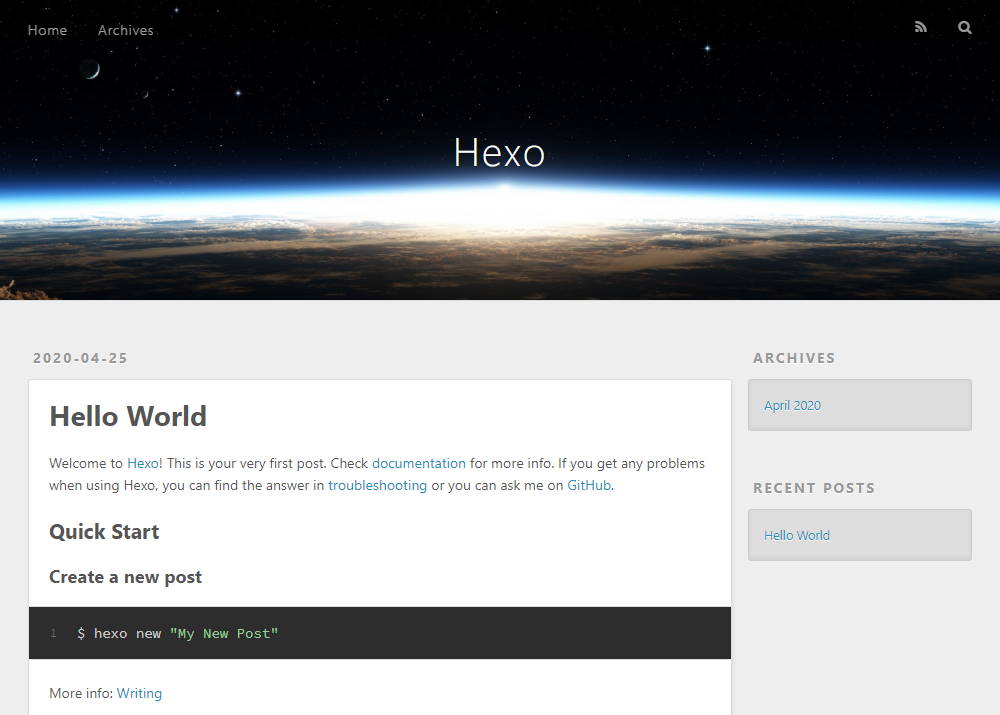
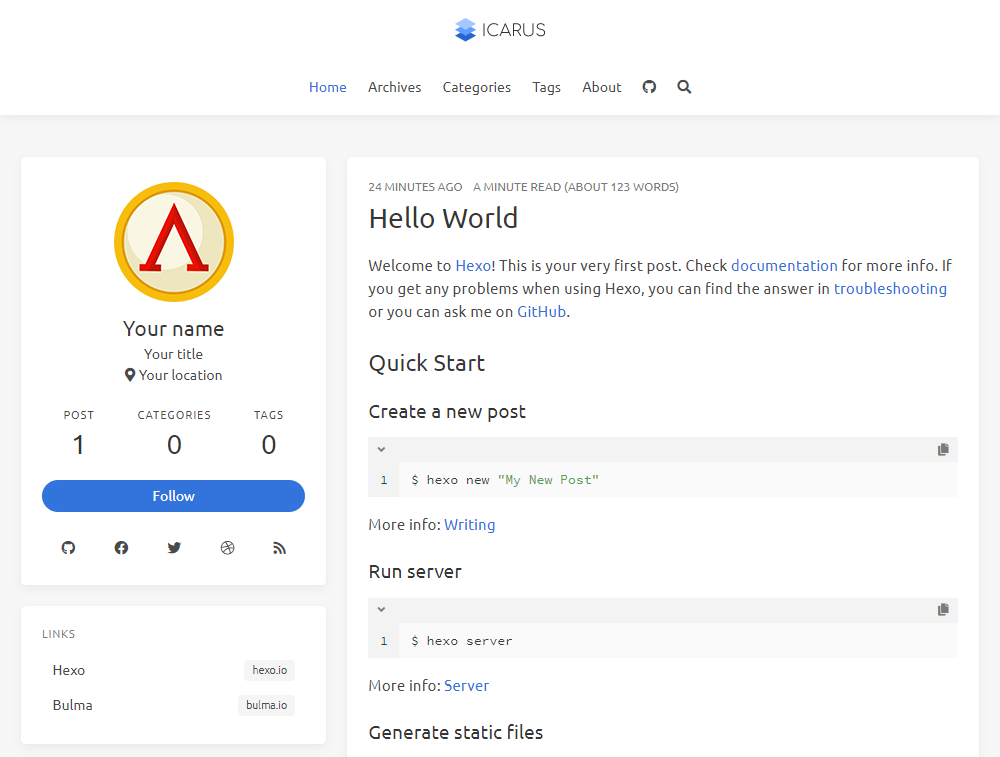

## 헥소(HEXO)란?

정적 웹 사이트(DB 통신 등을 해서 서버에서 HTML 페이지를 실시간으로 만들던 동적 사이트 방식이 아닌, 완성된 HTML 파일을 바로 전달) 생성기이며, 대표적으로 지킬([Jekyll](https://jekyllrb.com/))과 헥소([Hexo](https://hexo.io/ko/index.html))가 있다. 지킬은 Ruby기반이며, 헥소는 Node.js기반의 도구이다. 나는 기존에 지킬 블로그를 이용하다가 최근에 헥소 블로그로 이전하였다. 이유는 지킬 블로그의 경우 포스팅을 작성한 후 깃허브 페이지에 배포하여 반영되기까지 매번 커밋 및 푸쉬를 해줘야 하는 번거로움과 푸쉬 후 약 1분정도의 시간이 지나야 반영이 되는 딜레이가 불편하였다. 헥소같은 경우 빠른 빌드 및 반영(명령어 단 한줄로 실시간 배포 가능) 및 로컬에서 바로 수정사항을 확인할 수 있다는 점(물론 지킬도 루비 기반의 플러그인을 따로 설치하면 로컬에서 바로 확인이 가능함), Node.js 기반의 도구인 점과 마지막으로 [icarus](https://github.com/ppoffice/hexo-theme-icarus)테마가 가장 마음에 들어서(사실 이 부분이 제일 큼)이다.

헥소 블로그의 경우, 일반적으로 깃허브 저장소가 2개 사용되는데, 하나는 소스가 빌드 및 배포되어 실질적으로 보여지는 저장소(예: ...github.io), 두번째는 실제 소스가 들어있는 저장소(블로그 설정 파일 및 테마 파일)가 있다.

## 설치 환경

* node.js
* git

## 헥소(HEXO) 설치

### 초기 세팅

`npm`을 이용하여 헥소를 전역으로 설치
```
$ npm install hexo-cli -g
```

원하는 디렉토리로 이동하여 헥소 블로그 초기 설치(이 포스팅에선 `hexo`라는 이름으로 초기 설치) 후 해당 디렉토리로 이동하여 노드 모듈 설치
```
$ hexo init hexo
$ cd hexo
$ npm install
```

설치 후 터미널에서 `hexo server`명령어를 실행해 준다. 로컬 서버가 구동되면 `http://localhost:4000`주소로 들어가 보자, 아래 화면이 나온다면 헥소가 정상적으로 설치된 것이다.




### icarus 테마 적용

이제 icarus 테마를 적용할 것이다. 우선 [icarus 저장소](https://github.com/ppoffice/hexo-theme-icarus)로 가서 테마를 다운 받은 뒤 압축을 풀어준다. 압축을 풀어주면 `hexo-theme-icarus-master`폴더가 있는데, `icarus`라고 이름을 변경한 뒤 `hexo`폴더의 `themes`폴더 안에 넣어준다. 기존의 `landscape(기본 테마)`는 삭제해 준다.

이제 설정 파일에서 테마를 `icarus`로 사용한다고 정해줘야 한다. `hexo`폴더 루트 경로에 `_config.yml`파일이 있다. 이 파일이 헥소 기본 설정파일이며, 여기서 전반적인 사이트 설정을 할 수 있다. `theme` 항목을 `icarus`로 수정해 준다.

```
theme: icarus
```

수정한 뒤 아래 명령어로 로컬서버를 다시 실행해 본다.

```
$ hexo server
```

서버가 정상적으로 실행이 안되고 아래 처럼 에러가 날 것이다.

```
ERROR Package bulma-stylus is not installed.
ERROR Package hexo-component-inferno is not installed.
ERROR Package hexo-renderer-inferno is not installed.
ERROR Package inferno is not installed.
ERROR Package inferno-create-element is not installed.
ERROR Please install the missing dependencies your Hexo site root directory:
ERROR npm install --save bulma-stylus@0.8.0 hexo-component-inferno@^0.2.4 hexo-renderer-inferno@^0.1.3 inferno@^7.3.3 inferno-create-element@^7.3.3
```

`icarus`테마는 위 패키지 설치가 필요해 보인다. 필요 패키지를 다시 설치한다.

```
$ npm install --save bulma-stylus@0.8.0 hexo-component-inferno@^0.2.4 hexo-renderer-inferno@^0.1.3 inferno@^7.3.3 inferno-create-element@^7.3.3
```
설치한 후 다시 서버를 실행하면 성공적으로 `icarus`테마 사이트가 만들어 진다.



### about 페이지 생성

살펴보니 about 페이지가 존재하지 않는다. 아래 명령어를 실행하여 페이지를 만들어 준다.

```
$ hexo new page about
```

명령어를 실행하면 `/sources/about/` 경로에 `index.md`파일이 생성된다. 이 파일에 원하는 내용을 작성하면 된다.

## 블로그 작성 하기

헥소 블로그는 터미널에서 아래 명령어를 실행하여 마크다운 파일을 생성할 수 있다.

```
hexo new post 포스트명
```

정해진 규칙은 아니지만 나는 `범주-내용`형식으로 포스트명을 지었다.(예: 자바스크립트의 클로저 포스팅일 경우 `javascript-closure` 라고 명명)

`/sources/_posts/` 경로에 마크다운 파일이 새로 생성되며 이곳에 포스팅을 작성하면 된다. 마크다운 문법은 [MarkDown 사용법 총정리](https://heropy.blog/2017/09/30/markdown/)에 설명이 잘 되어있다.

## 깃허브 페이지에 배포하기

이제 깃허브 페이지에 배포를 해보자

### 깃허브 저장소(배포 페이지) 생성

우선 헥소 블로그는 2개의 저장소를 사용하는데, 한개는 배포 페이지(보여지는 블로그 페이지)로 사용되며 한개는 실제 소스가 들어가는 저장소다.

우선 배포 페이지 저장소를 만들어 준다. 저장소 이름은 `사용자계정.github.io`로 만들어 준다. 깃허브 페이지가 정상적으로 호스팅 되는것을 확인하기 위해 `Initialize this repository with a README`는 체크해 준다. 저장소가 생성 되면 `README.md`도 같이 생성이 된다. 이제 `settings`페이지로 가서 `GitHub Pages`항목에서 `Source` 옵션을 `master branch`로 선택해 준다. `Your site is published at https://사용자계정.github.io/`라는 문구가 뜨며, 이제 `https://사용자계정.github.io`주소로 들어가면 페이자가 정상으로 출력되는 것을 확인할 수 있다.

### 깃허브 저장소 주소 설정

배포하기전 헥소 설정 파일에서 배포할 저장소를 입력해줘야 한다. `hexo`폴더 루트 경로에 `_config.yml`파일에 가면 아래 항목이 있다.

```
deploy:
  type: ''
```

위 항목을 아래처럼 설정해 준다.

```
deploy:
  type: git
  repo: 저장소 주소(예: https://github.com/사용자계정/사용자계정.github.io.git)
  branch: master
```

### 배포 플러그인 설치

깃허브 페이지에 배포하기 위해선 `hexo-deployer-git`플러그인을 설치해줘야 한다. 아래 명령어를 사용하여 설치해 준다.

```
npm install --save hexo-deployer-git
```

### 정적 리소스 생성하기 

아래 명령어를 실행하면 `public`폴더가 생성되면서 정적 리소스가 생성된다. 이 파일들이 실제로 깃허브 페이지에 배포될 파일들이다.

```
$ hexo generate
```

### 배포하기

아래 명령어를 사용하면 생성한 정적 리소스를 배포하게 된다. `사용자계정.github.io`주소로 들어가면 정상적으로 배포된 것을 확인할 수 있다.

```
$ hexo deploy
```

정적 리소스를 삭제하는 명령어는 아래 명령어를 사용하면 된다. 간혹 정상적으로 배포가 되었음에도 불구하고 페이지가 업데이트 되지 않는 현상이 있는 경우 사용하면 된다.

```
$ hexo clean
```

정적 리소스 및 배포를 동시에 하고싶다면 아래 명령어를 사용하면 된다.

```
$ hexo deploy --generate
```

## 깃허브 저장소에 소스 저장하기

위의 배포 과정은 보여지는 페이지를 저장한 것이고, 이제 실제 소스를 깃허브 저장소에 저장할 것이다. 새로운 저장소를 만들어 준다. 나는 `hexo`라고 저장소를 생성하였다. 다시 `hexo`폴더로 가서 아래 명령어를 입력해 깃을 설치하고, 소스가 들어갈 저장소를 선택한 뒤 푸쉬해준다.

```
$ git init
$ git remote add origin 저장소 주소
$ git add .
$ git commit -m '커밋 메세지'
$ git push origin master
```
 
간혹 깃의 히스토리가 충돌되어 푸쉬가 안되는 경우가 있는데 이런 상황에는 아래 명령어를 사용하여 해결해 준다.

```
$ git pull origin 브랜치명 --allow-unrelated-histories
```

## References
[Github Page와 Hexo를 통해 30분만에 기술 블로그 만들기](https://www.holaxprogramming.com/2017/04/16/github-page-and-hexo/)  
[Github 블로그 만들기 with Hexo - 초기설정](https://mingpd.github.io/2019/04/14/github-blog-with-hexo-1/)  
[Jekyll을 이용한 무료 블로그 만들기](https://wepplication.github.io/programming/jekyll/)
