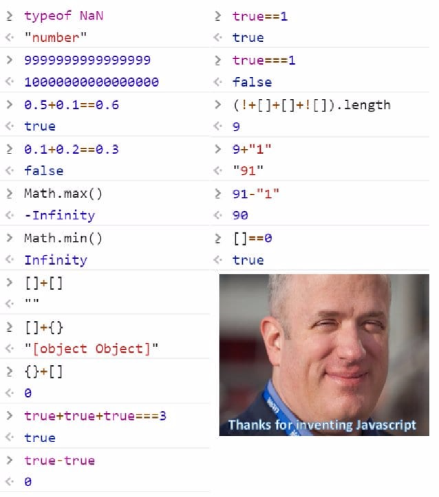

# 자바스크립트 소개
자바스크립트는 프로토타입 기반의 스크립트 언어이며 넷스케이프사의 브렌던 아이크가 만들었다. <strike>(그는 10일 만에 언어를 만들었다.)</strike> 주로 웹 브라우저 내에서 주로 사용되며 node.js와 같은 런타입 환경에서 서버 사이드 프로그래밍으로도 사용되고 있다.

> 언어의 타입이 너무 유연해서 인터넷에 위같은 밈이 돌아다닌다.

초창기 자바스크립트는 웹 페이지 제작에 있어서 보조적인 기능을 수행하기 위한 용도로써 사용되었다. 클라이언트인 웹 브라우저에서 서버로부터 받은 HTML과 CSS, 데이터로 렌더링을 해주는 수준이였다. 이 시절에 자바스크립트는 그다지 중요한 역할을 담당하지 못했다. 하지만 소수의 프로그래머들에 의해 여러 가지 연구가 이루어졌고, 웹 아키텍쳐에도 크고 작은 변화가 일어났다. 특히 과거에 서버에서 담당했던 역할들이 상당 부분 웹 브라우저로 이동하였고, 자바스크립트는 이 변화의 중점에 서게 된다. 게다가 jQuery 의 등장으로 보다 쉽게 DOM을 핸들링하게 되면서 많은 발전을 이루었다.

현재는 브라우저 기반의 자바스크립트 라이브러리 뿐만 아니라 Node.js와 같은 서버 기반의 자바스크립트 환경에서 동작할 수 있는 각종 라이브러리까지 쏟아져 나오고 있다. 이제는 자바스크립트만으로 웹 서버와 클라이언트인 웹 페이지 개발을 동시에 할 수 있는 수준까지 왔다고 볼 수 있다.

자바스크립트는 클래스를 지원하지 않아 클래스 상속을 이용한 **객체 지향 프로그래밍**은 할 수 없지만, 프로토타입의 복제 과정을 이용하여 상속을 흉내내도록 구현이 가능하다.

> ##### 객체 지향 프로그래밍(OOP)
줄여서 OOP라고 부르겠다. OOP는 컴퓨터 프로그래밍 패러다임중 하나이며, 컴퓨터 프로그램을 명령어의 목록으로 보는 시각에서 벗어나 여러개의 독립된 단위, 즉 "객체" 들의 모임으로 파악하고자 하는 것이다. 각각의 객체들은 메시지를 주고받고, 데이터를 처리할 수 있다.  
객체지향 프로그래밍은 프로그램을 유연하고 변경이 용이하게 만들기 때문에 대규모 소프트웨어 개발에 많이 사용되고, 보수를 간편하게 하며 보다 직관적인 코드 분석을 가능하게 하는 장점을 가지고 있다.  
객체지향의 반대로는 절차지향 프로그래밍(procedural Programming)이라는 패러다임이 있다. 절차지향 프로그래밍이란 순차적인 처리가 중요시되며, 프로그램 전체가 유기적으로 연결되도록 만드는 프로그래밍 기법이다. 대표적인 절차지향 언어에는 C언어가 있다. OOP의 특성으로는 추상화(Abstraction), 캡슐화(Encapsulation), 상속(Inheritance), 다형성(Polymorphism)이 있다.

